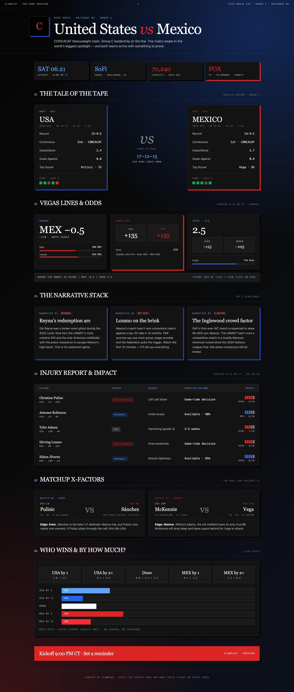
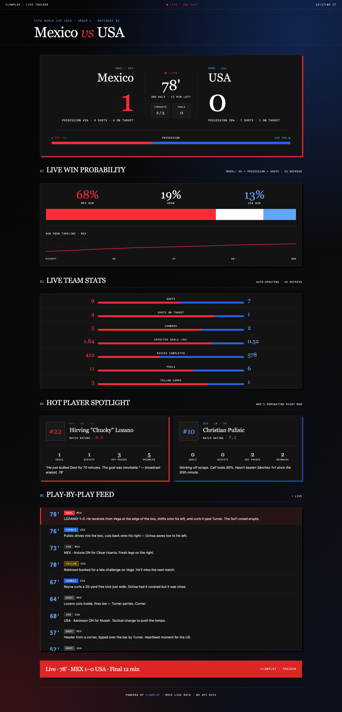
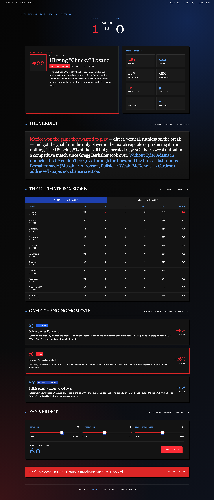
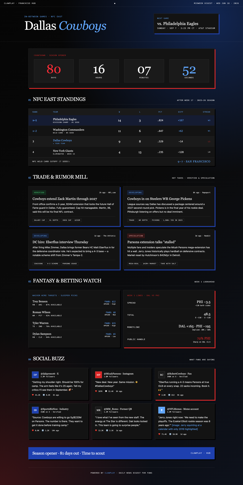

<!-- clawplay — Handout-quality sports reports for 24+ sports -->

<p align="center">
  <a href="https://github.com/tylerdotai/clawplay/blob/main/LICENSE"></a>
  <a href="#"></a>
  <a href="#"></a>
  <a href=".github/workflows/ci.yml"></a>
  <a href="#"></a>
</p>

<p align="center"><strong>Handout-quality sports reports for 24+ sports — previews, live trackers, recaps, and franchise hubs.</strong></p>
<p align="center">Pure HTML, dark-themed, print-ready. No API keys.</p>

[clawplay](https://github.com/tylerdotai/clawplay) pulls live scoreboards, match previews, recaps, and live trackers for 24+ sports. Everything renders to self-contained, dark-themed HTML — mobile-first by default, with handout-quality print sheets matching the ClawPlex design system.

No API keys. No rate limits. No scraping detective work. Just `pip install -e .` and go.

<p align="center">
<br /><em>Pre-game preview — Tale of the Tape, Vegas Lines, Narrative Stack, Injury Report, X-Factors, interactive Fan Poll. 8.5×11" print sheet ready.</em></p>

---

## Contents

- [About](#about)
- [Built With](#built-with)
- [Installation](#installation)
- [Usage](#usage)
- [The Four Report Modes](#the-four-report-modes)
- [Screenshots](#screenshots)
- [Per-Sport Design Specs](#per-sport-design-specs)
- [Roadmap](#roadmap)
- [Contributing](#contributing)
- [License](#license)
- [Acknowledgments](#acknowledgments)

---

## About

**clawplay** is a sports aggregator with four report modes:

1. **PRE-GAME PREVIEW** — Tale of the Tape, Vegas lines, narrative stack, injury report with impact scores, positional X-factor matchups, interactive fan poll. *Handout-quality print sheet (8.5×11").*
2. **LIVE TRACKER** — Mega-scoreboard, live win-probability bar with sparkline timeline, side-by-side live stats, hot player spotlight, scrolling play-by-play feed with color-coded importance tags. *Pulsing neon live indicator.*
3. **POST-GAME RECAP** — Final score hero with MVP card, AI-generated "Verdict" summary, interactive box score with team tabs, 3 game-changing moments with win-prob deltas, fan verdict slider. *Premium digital magazine layout.*
4. **FRANCHISE HUB** — Live league standings with wild-card cutoff, trade & rumor mill (verified/developing/speculation), fantasy waiver targets + lookahead betting lines, social buzz feed, prominent countdown to next game. *Midweek digest format.*

All four modes are **single-file HTML** with Tailwind CDN, native JavaScript, and realistic mock data — no API keys required. The Python package renders dark-themed, mobile-first scoreboards and pre-game / post-game match reports that aggregate from multiple sources (Goal.com, ESPN, BBC Sport, FMHY, Wikipedia).

---

## Built With

- [Python 3.9+](https://www.python.org/) — core language
- [Playwright](https://playwright.dev/) — headless browser via clawplay HTTP client
- [FastAPI](https://fastapi.tiangolo.com/) — optional: run your own browser service
- [Tailwind CSS](https://tailwindcss.com/) (CDN) — premium HTML templates
- [Goal.com](https://www.goal.com/), [ESPN](https://www.espn.com/), [BBC Sport](https://www.bbc.com/sport), [FMHY.net](https://fmhy.net/), [Wikipedia](https://en.wikipedia.org/) — data sources
- [pytest](https://pytest.org/) + [ruff](https://github.com/astral-sh/ruff) — testing + linting

The visual design language is the ClawPlex design system — dark, premium, no orange, Georgia display headlines + Karla body + JetBrains Mono labels, hard-offset colored shadows, radial-gradient page backgrounds, mono uppercase tracking labels. Inspired by the Spark Arlington 06/10 meetup handouts.

---

## Installation

```bash
git clone https://github.com/tylerdotai/clawplay.git
cd clawplay
pip install -e .

# Optional dev deps (tests, lint, server)
pip install -e ".[dev]"
```

Set the browser service URL (default `http://localhost:9300`):

```bash
export CLAWPLAY_URL="http://localhost:9300"
```

Or run your own — any FastAPI + Playwright service that exposes `/health`, `/eval`, `/extract`, `/screenshot`.

---

## Usage

### CLI — live scoreboards

```bash
# Generate a live scoreboard for any sport
clawplay-report nba --output nba.html
clawplay-report worldcup --output wc.html
clawplay-report all --output today.html --group-by status

# Filter, customize, dump JSON
clawplay-report epl --find "Arsenal" --output arsenal.html --title "Arsenal watch"
clawplay-report nfl --group-by competition --json
```

### CLI — match reports (preview / recap)

```bash
# Pre-game preview for a specific game
clawplay-match "USA Mexico" --sport worldcup --output usa_mexico_preview.html

# Post-game recap
clawplay-match "Mexico Korea Republic" --sport worldcup --output mexico_korea_recap.html

# Skip live aggregation (faster, less rich)
clawplay-match "USA Mexico" --sport worldcup --no-aggregate --output preview_static.html
```

### CLI — raw JSON to stdout

```bash
clawplay-live nba           # all NBA games today, JSON
clawplay-live soccer_live   # all live soccer matches globally
clawplay-live all           # everything
clawplay-live find "Lakers"   # find a specific team
```

### Python library

```python
import clawplay

# Live scoreboards
nba = clawplay.scores.nba_today()
print(f"{nba['count']} NBA games today")
clawplay.write_report(nba['games'], 'nba.html', title='NBA — Tonight')

# Find a specific game
result = clawplay.scores.find_game('Lakers')
if result['found_in']:
    print(f"Found in {result['found_in']}: {result['game']}")

# Match reports with multi-source aggregation
from clawplay import MatchReport, Aggregator, write_match_report

match = MatchReport(
    'worldcup', 'USA', 'Mexico',
    kickoff='2026-06-21T20:00:00-05:00',
    status='SCHEDULED',
    competition='FIFA World Cup 2026',
    venue='SoFi Stadium, Inglewood',
)
Aggregator().aggregate_match(match)   # pulls from ESPN + BBC + FMHY + Wikipedia
write_match_report(match, 'usa_mexico.html')
```

### Local timezone

All times render in **CST/CDT (America/Chicago)** by default. Override via env var:

```bash
export CLAWPLAY_TZ="America/New_York"
```

---

## The Four Report Modes

Located under `templates/`. Each is a single self-contained HTML file with Tailwind CDN + native JS. Open in any browser.

| Mode | File | Use case |
| --- | --- | --- |
| **PREVIEW** | [templates/preview.html](templates/preview.html) | Pre-game hype sheet · Tale of the Tape · Vegas odds · Fan poll |
| **LIVE** | [templates/live.html](templates/live.html) | Live tracker · Score · Win probability · Play-by-play |
| **RECAP** | [templates/recap.html](templates/recap.html) | Post-game analytics · MVP · Box score · Fan verdict |
| **HUB** | [templates/hub.html](templates/hub.html) | Midweek digest · Standings · Rumors · Fantasy · Countdown |

Open any of them locally — no build step:

```bash
open templates/preview.html   # macOS
```

---

## Screenshots

### Pre-game preview


*Pre-game preview — Tale of the Tape, Vegas Lines, Narrative Stack, Injury Report, X-Factors, interactive Fan Poll. 8.5×11" print sheet ready.*

### Live tracker


*Live tracker — pulsing mega-scoreboard, win-probability bars + sparkline, hot-player spotlight, color-tagged play-by-play feed.*

### Post-game recap


*Post-game recap — MVP hero card, AI-generated Verdict, tabbed box score, 3 turning points with win-probability deltas, Fan Verdict sliders.*

### Franchise hub


*Franchise hub — NFC East standings, trade & rumor mill (verified / developing / speculation), fantasy + lookahead betting lines, social buzz feed, prominent countdown.*

---

## Per-Sport Design Specs

Each of the 22 sports has its own `design.md` spec — color palette, typography, section order, mock-data schema, vocabulary, visual motifs, tone. They don't share a colorway. The shared editorial standard lives in [templates/MASTER_PROMPT.md](templates/MASTER_PROMPT.md); the per-sport overrides live under [templates/designs/](templates/designs/).

Available specs: [NFL](templates/designs/nfl.md) · [NBA](templates/designs/nba.md) · [NHL](templates/designs/nhl.md) · [MLB](templates/designs/mlb.md) · [MLS](templates/designs/mls.md) · [WNBA](templates/designs/wnba.md) · [CFB](templates/designs/cfb.md) · [CBB](templates/designs/cbb.md) · [CBB_W](templates/designs/cbb_w.md) · [EPL](templates/designs/epl.md) · [UCL](templates/designs/ucl.md) · [La Liga](templates/designs/laliga.md) · [Bundesliga](templates/designs/bundes.md) · [Serie A](templates/designs/seriea.md) · [World Cup](templates/designs/worldcup.md) · [Soccer Live](templates/designs/soccer_live.md) · [UFC](templates/designs/ufc.md) · [Tennis](templates/designs/tennis.md) · [Golf](templates/designs/golf.md) · [Cricket](templates/designs/cricket.md) · [Rugby](templates/designs/rugby.md)

---

## Roadmap

- [x] Multi-source aggregator (Goal.com + ESPN + BBC + FMHY + Wikipedia)
- [x] Handout-quality match reports (8.5×11 print sheet)
- [x] Four report templates (Preview · Live · Recap · Hub)
- [x] CST/DFW timezone formatting throughout
- [x] pytest TDD · ruff lint · GitHub Actions CI
- [x] MIT license, public on GitHub
- [x] `templates/MASTER_PROMPT.md` — shared editorial standard
- [x] `templates/designs/*.md` — per-sport design specs (22 sports)
- [ ] Live data wired into all 4 HTML templates (currently mock)
- [ ] Configurable team colors (currently ClawPlex palette)
- [ ] Tailwind build pipeline (currently CDN)
- [ ] Interactive SVG play diagrams (NFL)
- [ ] xG-style charts for soccer
- [ ] Push to Discord / iMessage / SMS
- [ ] NFL play-by-play via ESPN API reverse-engineered
- [ ] Self-hosted web UI (Flask/FastAPI)
- [ ] Fantasy sync (Sleeper, Yahoo, ESPN)

See [open issues](https://github.com/tylerdotai/clawplay/issues) for the full backlog.

---

## Contributing

PRs welcome. The flow:

1. Fork & branch from `main`
2. `pip install -e ".[dev]"`
3. Add tests under `tests/`
4. `pytest` · `ruff check src/ tests/`
5. Submit a PR — CI runs on every push

For new sports:

1. Find the official scoreboard URL
2. Open it in Chrome, inspect the live-widget DOM
3. Write a JS extraction pattern (see existing sports in `src/clawplay/live_scores.py`)
4. Add to `SPORTS` and a `<sport>_today()` method to `LiveScores`
5. Add tests with mock `Clawplay`

For new templates, model the structure off `templates/preview.html` — Georgia display + mono labels + hard-offset colored shadows + radial-gradient bg are non-negotiable design tokens.

---

## License

Distributed under the MIT License. See [LICENSE](LICENSE) for the full text.

---

## Acknowledgments

- [Playwright](https://playwright.dev/) — headless browser engine
- [ESPN](https://www.espn.com/), [Goal.com](https://www.goal.com/), [BBC Sport](https://www.bbc.com/sport), [FMHY.net](https://fmhy.net/), [Wikipedia](https://en.wikipedia.org/) — data sources
- [othneildrew's Best-README-Template](https://github.com/othneildrew/Best-README-Template) — README structure
- [ClawPlex design system](https://github.com/tylerdotai/clawplex) — visual language (dark, premium, no orange)
- Spark Coworking · Arlington TX — June 10 meetup · inspiration for handout typography
- Built for sports fans who want their scores on their terms

---

<p align="center"><a href="https://github.com/tylerdotai/clawplay">github.com/tylerdotai/clawplay</a></p>
