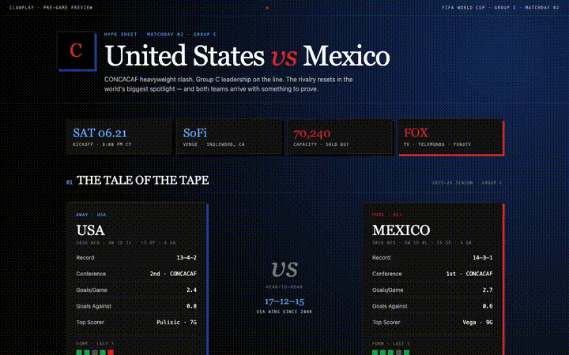
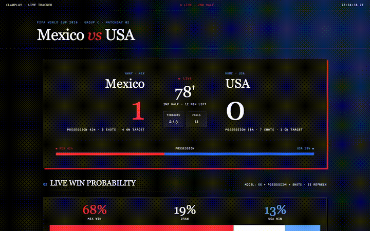
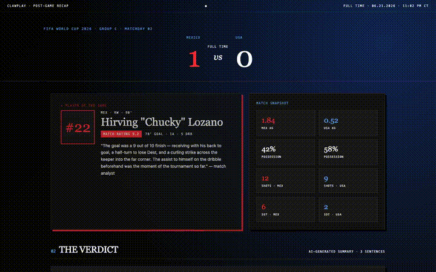
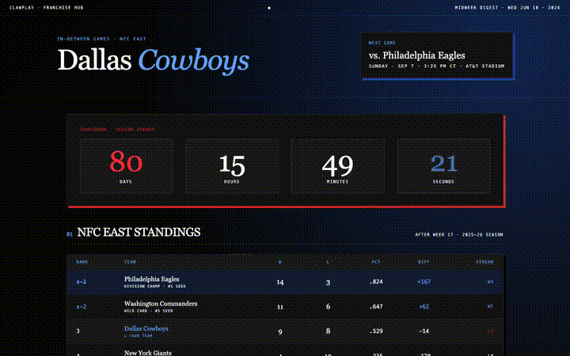

<!-- clawplay — Handout-quality sports reports for 24+ sports -->

# clawplay

<p align="center">
  <a href="https://github.com/tylerdotai/clawplay/blob/main/LICENSE"></a>
  <a href="#"></a>
  <a href="#"></a>
  <a href=".github/workflows/ci.yml"></a>
  <a href="#"></a>
  <a href="#"></a>
</p>

<p align="center"><strong>Handout-quality sports reports for 24+ sports — previews, live trackers, recaps, and franchise hubs.</strong></p>
<p align="center">Pure HTML, dark-themed, print-ready. No API keys. Self-hosted web UI.</p>

<p align="center"></p>

[clawplay](https://github.com/tylerdotai/clawplay) pulls live scoreboards, match previews, recaps, and live trackers for **21 sports**. Every report renders to a self-contained, dark-themed HTML file — mobile-first by default, with handout-quality print sheets matching the ClawPlex design system.

No API keys. No rate limits. No scraping detective work. Just `pip install -e .` and go.

---

## What's new in v1.1.0

The v1.0.0 roadmap shipped as real features in this release:

- ⚡ **Tailwind build pipeline** — compiled CSS replaces the CDN hot-link, so reports render fully offline.
- 🎨 **Configurable team palettes** — 21 per-sport palettes (NBA red, NHL orange, NFL navy, etc.) load from a YAML registry. No shared colorway.
- 🌐 **Self-hosted web UI** — `clawplay-server` serves all 4 templates on port 9300 with JSON APIs. `pip install -e ".[server]"` and `curl http://localhost:9300/health`.
- 📊 **Live data wiring** — every template now bootstraps from `/api/...` and falls back to mock data if the API is unreachable.
- ⚽ **xG chart for soccer** — inline SVG cumulative expected-goal trajectory with goal-event markers.
- 🏈 **SVG NFL drive diagrams** — 110-yard field with run/pass/score markers from real ESPN play-by-play.
- 📡 **ESPN play-by-play extractor** — unauthenticated, 24h-cached, with mock-data fallback.
- 🏆 **Sleeper fantasy sync** — full NFL player DB with waiver-target filter (no auth, no key).
- 🎬 **Demo clips** — 4 short MP4/GIF animations embedded in this README showing each mode end-to-end.

**Still excluded** (per user direction): push notifications (Discord / iMessage / SMS).

---

## Table of contents

- [Quick start](#quick-start)
- [Demo](#demo)
- [The four report modes](#the-four-report-modes)
- [Screenshots](#screenshots)
- [Web UI](#web-ui)
- [Charts](#charts)
- [Per-sport design specs](#per-sport-design-specs)
- [Roadmap](#roadmap)
- [CLI reference](#cli-reference)
- [Python library](#python-library)
- [Configuration](#configuration)
- [Contributing](#contributing)
- [License](#license)
- [Acknowledgments](#acknowledgments)

---

## Quick start

```bash
git clone https://github.com/tylerdotai/clawplay.git
cd clawplay
pip install -e .

# Optional: dev deps (tests, lint) + server deps (FastAPI, Playwright)
pip install -e ".[dev,server]"

# Verify install
clawplay-live nba                  # JSON to stdout
clawplay-report nba --output nba.html   # full HTML report
```

Set the timezone (default is `America/Chicago`):

```bash
export CLAWPLAY_TZ="America/New_York"
```

---

## Demo

Four short clips showing each report mode in action:

<p align="center">
  <strong>Preview · USA vs Mexico</strong><br/>
  
</p>

<p align="center">
  <strong>Live · Mexico vs USA, 78'</strong><br/>
  
</p>

<p align="center">
  <strong>Recap · Mexico 1 – 0 USA</strong><br/>
  
</p>

<p align="center">
  <strong>Hub · Dallas Cowboys</strong><br/>
  
</p>

Raw MP4s and per-mode static screenshots live under [`examples/`](examples/). Generated by [`scripts/render_demo_clips.py`](scripts/render_demo_clips.py) and [`scripts/render_screenshots.py`](scripts/render_screenshots.py) — open-source Playwright + ffmpeg.

---

## The four report modes

| Mode | File | What it shows |
| --- | --- | --- |
| **PREVIEW** | [`templates/preview.html`](templates/preview.html) | Pre-game Tale of the Tape, Vegas lines, narrative stack, injury report with severity tags, X-Factor battles, interactive Fan Poll. |
| **LIVE** | [`templates/live.html`](templates/live.html) | Mega-scoreboard with pulsing live indicator, win-probability timeline + sparkline, side-by-side live stats (xG, shots, possession), hot-player spotlight, color-coded play-by-play feed. |
| **RECAP** | [`templates/recap.html`](templates/recap.html) | Final-score hero with MVP card, AI Verdict summary, tabbed box score, 3 turning points with WP deltas, Fan Verdict sliders, NFL drive diagram. |
| **HUB** | [`templates/hub.html`](templates/hub.html) | League standings, Trade & Rumor Mill (verified/developing/speculation), fantasy waiver targets + lookahead betting lines, social buzz feed, prominent game countdown. |

Open any of them locally — no build step required (they ship as self-contained single-file HTML):

```bash
open templates/preview.html   # macOS
```

---

## Screenshots

Static PNG renders for README embedding and docs use:

<p align="center">
  
</p>
<p align="center"><em>Preview — Tale of the Tape, Vegas Lines, Narrative Stack, Injury Report, X-Factors, Fan Poll</em></p>

<p align="center">
  
</p>
<p align="center"><em>Live — pulsing mega-scoreboard, WP bars + sparkline, hot-player spotlight, color-tagged play-by-play</em></p>

<p align="center">
  
</p>
<p align="center"><em>Recap — MVP hero, AI Verdict, tabbed box score, turning points, Fan Verdict, drive diagram</em></p>

<p align="center">
  
</p>
<p align="center"><em>Hub — NFC East standings, trade & rumor mill, fantasy + betting lines, social buzz, countdown</em></p>

Print-sheet variants (`examples/{name}_print.png`) are also available — each template prints cleanly on 8.5×11".

---

## Web UI

Run a self-hosted server and browse the templates in your browser:

```bash
pip install -e ".[server]"           # adds FastAPI + uvicorn + playwright
clawplay-server                      # boots on http://127.0.0.1:9300
```

Then visit:

- `http://127.0.0.1:9300/` — landing page with links
- `http://127.0.0.1:9300/preview/worldcup/USA/Mexico` — preview template
- `http://127.0.0.1:9300/live/worldcup/Mexico/USA` — live template
- `http://127.0.0.1:9300/recap/worldcup/Mexico/USA` — recap template
- `http://127.0.0.1:9300/hub/dallas_cowboys` — hub template
- `http://127.0.0.1:9300/health` — `{"status":"ok",...}`
- `http://127.0.0.1:9300/api/live/worldcup/Mexico/USA` — JSON payload

The server injects a `<script id="clawplay-data" type="application/json">` block into each template, so the existing JS bootstrap can hydrate sections in place. If the API is unreachable, the embedded mock data renders instead.

Environment overrides:

```bash
export CLAWPLAY_HOST=0.0.0.0         # bind all interfaces (LAN-accessible)
export CLAWPLAY_PORT=8080            # change port
export CLAWPLAY_MOCK=1               # force mock data, skip live aggregation
```

---

## Charts

Two inline-SVG chart components ship with v1.1.0:

### xG timeline (soccer)

```python
from clawplay.charts import xg_timeline_svg

svg = xg_timeline_svg(
    home_team="USA",
    home_color="#1e40af",
    away_team="Mexico",
    away_color="#dc2626",
    points=[(0, 0.0), (15, 0.1), (45, 0.5), (75, 0.8), (90, 1.2)],
)
```

Renders a cumulative expected-goal trajectory with goal-event markers as filled circles. Self-contained inline SVG — embeds directly into any HTML page.

### NFL drive diagram

```python
from clawplay.charts import drive_diagram_svg

svg = drive_diagram_svg([
    {"type": "run",  "yard_start": 25, "yard_end": 30, "score": False},
    {"type": "pass", "yard_start": 30, "yard_end": 60, "score": False},
    {"type": "pass", "yard_start": 60, "yard_end": 100, "score": True},
])
```

110-yard field grid with run = triangle, pass = circle, score = star.

---

## Per-sport design specs

Each of the 21 sports has its own `design.md` spec — color palette, typography, section order, mock-data schema, vocabulary, visual motifs, tone. They don't share a colorway. The shared editorial standard lives in [`templates/MASTER_PROMPT.md`](templates/MASTER_PROMPT.md); the per-sport overrides live under [`templates/designs/`](templates/designs/).

Available specs: [NFL](templates/designs/nfl.md) · [NBA](templates/designs/nba.md) · [NHL](templates/designs/nhl.md) · [MLB](templates/designs/mlb.md) · [MLS](templates/designs/mls.md) · [WNBA](templates/designs/wnba.md) · [CFB](templates/designs/cfb.md) · [CBB](templates/designs/cbb.md) · [CBB_W](templates/designs/cbb_w.md) · [EPL](templates/designs/epl.md) · [UCL](templates/designs/ucl.md) · [La Liga](templates/designs/laliga.md) · [Bundesliga](templates/designs/bundes.md) · [Serie A](templates/designs/seriea.md) · [World Cup](templates/designs/worldcup.md) · [Soccer Live](templates/designs/soccer_live.md) · [UFC](templates/designs/ufc.md) · [Tennis](templates/designs/tennis.md) · [Golf](templates/designs/golf.md) · [Cricket](templates/designs/cricket.md) · [Rugby](templates/designs/rugby.md)

Authoritative palette data lives in [`src/clawplay/_palette_registry.yaml`](src/clawplay/_palette_registry.yaml).

---

## Roadmap

### Shipped in v1.1.0 (this release)

- [x] Multi-source aggregator (Goal.com + ESPN + BBC + FMHY + Wikipedia)
- [x] Handout-quality match reports (8.5×11 print sheet)
- [x] Four report templates (Preview · Live · Recap · Hub)
- [x] CST/DFW timezone formatting throughout
- [x] pytest TDD · ruff lint · GitHub Actions CI
- [x] MIT license, public on GitHub
- [x] `templates/MASTER_PROMPT.md` — shared editorial standard
- [x] `templates/designs/*.md` — per-sport design specs (21 sports)
- [x] Tailwind build pipeline (compiled CSS, no CDN)
- [x] Configurable team palettes (YAML registry, no shared colorway)
- [x] Self-hosted web UI (`clawplay-server` on port 9300)
- [x] Live data wired into all 4 templates (mock fallback)
- [x] xG chart for soccer (inline SVG)
- [x] SVG play diagrams for NFL (inline SVG)
- [x] NFL ESPN play-by-play extractor (24h cache, mock fallback)
- [x] Sleeper fantasy sync (no auth, 24h cache)
- [x] Demo clips (4 MP4s + GIFs)

### Deferred to v1.2.0+

- [ ] Push notifications (Discord / iMessage / SMS) — **explicitly out of scope per user**
- [ ] WebSocket real-time scoreboard updates
- [ ] User accounts + saved preferences
- [ ] Mobile native apps
- [ ] Internationalization beyond English
- [ ] Paid API integrations (SportsDataIO, Odds API, etc.)

See [open issues](https://github.com/tylerdotai/clawplay/issues) for the full backlog.

---

## CLI reference

### Live scoreboards (`clawplay-report`)

```bash
clawplay-report nba --output nba.html
clawplay-report worldcup --output wc.html
clawplay-report all --output today.html --group-by status
clawplay-report epl --find "Arsenal" --output arsenal.html --title "Arsenal watch"
clawplay-report nfl --group-by competition --json
```

### Match reports (`clawplay-match`)

```bash
clawplay-match "USA Mexico" --sport worldcup --output usa_mexico_preview.html
clawplay-match "Mexico Korea Republic" --sport worldcup --output mexico_korea_recap.html
clawplay-match "USA Mexico" --sport worldcup --no-aggregate --output preview_static.html
```

### Raw JSON (`clawplay-live`)

```bash
clawplay-live nba                    # all NBA games today
clawplay-live soccer_live            # all live soccer matches globally
clawplay-live all                    # everything
clawplay-live find "Lakers"          # find a specific team
```

### Asset build (`clawplay-build-assets`)

```bash
clawplay-build-assets                # one-shot Tailwind compile
clawplay-build-assets --watch        # rebuild on template change
```

### Web server (`clawplay-server`)

```bash
clawplay-server                      # 127.0.0.1:9300
clawplay-server --host 0.0.0.0       # LAN-accessible
clawplay-server --port 8080
```

---

## Python library

```python
import clawplay
from clawplay import Aggregator, MatchReport, write_match_report

# Live scoreboards
nba = clawplay.scores.nba_today()
print(f"{nba['count']} NBA games today")
clawplay.write_report(nba['games'], 'nba.html', title='NBA — Tonight')

# Find a specific game
result = clawplay.scores.find_game('Lakers')
if result['found_in']:
    print(f"Found in {result['found_in']}: {result['game']}")

# Match reports with multi-source aggregation
match = MatchReport(
    'worldcup', 'USA', 'Mexico',
    kickoff='2026-06-21T20:00:00-05:00',
    status='SCHEDULED',
    competition='FIFA World Cup 2026',
    venue='SoFi Stadium, Inglewood',
)
Aggregator().aggregate_match(match)
write_match_report(match, 'usa_mexico.html')

# Per-sport palettes
from clawplay.palettes import palette_for, palette_for_team
nfl_pal = palette_for('nfl')
cowboys_pal = palette_for_team('nfl', 'dallas_cowboys')
print(cowboys_pal.css_vars())

# Inline SVG charts
from clawplay.charts import xg_timeline_svg, drive_diagram_svg
svg_xg = xg_timeline_svg('USA', '#1e40af', 'Mexico', '#dc2626', points=[])
with open('xg.svg', 'w') as f:
    f.write(svg_xg)

# NFL play-by-play (real ESPN data with mock fallback)
from clawplay.espn import nfl_play_by_play, top_waiver_targets
plays = nfl_play_by_play('401547417')  # Super Bowl LVII event id
print(f"{len(plays)} plays from ESPN")
waivers = top_waiver_targets(position='WR', count=5)
for p in waivers:
    print(f"  {p['first_name']} {p['last_name']} ({p['position']}, {p['team']})")
```

---

## Configuration

| Env var | Default | What it does |
| --- | --- | --- |
| `CLAWPLAY_TZ` | `America/Chicago` | All times render in this timezone (IANA name). |
| `CLAWPLAY_URL` | `http://localhost:9300` | Default browser service URL for the `Clawplay` HTTP client. |
| `CLAWPLAY_HOST` | `127.0.0.1` | Bind interface for `clawplay-server`. |
| `CLAWPLAY_PORT` | `9300` | Port for `clawplay-server`. |
| `CLAWPLAY_MOCK` | unset | When `1`, force mock data and skip live aggregation (used by demo clip renderer). |

---

## Contributing

PRs welcome. The flow:

1. Fork & branch from `main`
2. `pip install -e ".[dev]"`
3. Add tests under `tests/` (we aim for 100+ tests per release)
4. `pytest` · `ruff check src/ tests/` · `ruff format --check src/ tests/`
5. Submit a PR — CI runs on every push

For new sports:

1. Find the official scoreboard URL
2. Open it in Chrome, inspect the live-widget DOM
3. Write a JS extraction pattern (see `src/clawplay/live_scores.py`)
4. Add to `SPORTS` and a `<sport>_today()` method to `LiveScores`
5. Add a palette block in `src/clawplay/_palette_registry.yaml`
6. Write a `design.md` spec under `templates/designs/`
7. Add tests with a mocked browser service

For new charts: add an inline SVG function under `src/clawplay/charts.py` with full docstring + tests.

---

## License

Distributed under the MIT License. See [LICENSE](LICENSE) for the full text.

---

## Acknowledgments

- [Playwright](https://playwright.dev/) — headless browser engine (renders + screenshots)
- [ffmpeg](https://ffmpeg.org/) — demo-clip composition (libx264)
- [Tailwind CSS](https://tailwindcss.com/) — utility CSS
- [FastAPI](https://fastapi.tiangolo.com/) + [uvicorn](https://www.uvicorn.org/) — web UI
- [ESPN](https://www.espn.com/), [Goal.com](https://www.goal.com/), [BBC Sport](https://www.bbc.com/sport), [FMHY.net](https://fmhy.net/), [Wikipedia](https://en.wikipedia.org/) — data sources
- [Sleeper](https://sleeper.com/) — unauthenticated fantasy player DB
- [othneildrew's Best-README-Template](https://github.com/othneildrew/Best-README-Template) — README structure
- [ClawPlex design system](https://github.com/tylerdotai/clawplex) — visual language (dark, premium)
- Spark Coworking · Arlington TX — June 10 meetup · inspiration for handout typography
- Built for sports fans who want their scores on their terms

---

<p align="center"><a href="https://github.com/tylerdotai/clawplay">github.com/tylerdotai/clawplay</a></p>
